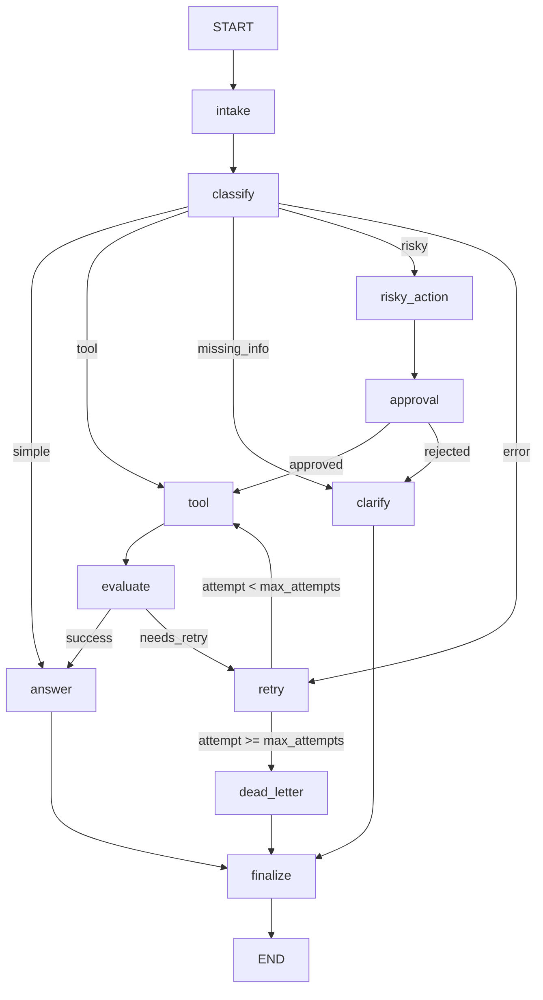

# Day 08 Lab Report

## 1. Team / student

- Name: Tống Anh Huyh
- Repo/commit: Main Branch
- Date: 2026-06-29

## 2. Architecture

The system utilizes LangGraph to coordinate a ticket-handling assistant. The architecture involves 11 nodes that normalize, classify, route, evaluate, process, and finalize operations.

## 3. State schema

The state schema is defined in `AgentState` with a mix of overwriting and appending fields:

| Field | Reducer | Why |
|---|---|---|
| thread_id | None (overwrite) | Identifies the unique session thread |
| scenario_id | None (overwrite) | Tracks scenario identifier |
| query | None (overwrite) | Stores current ticket query |
| route | None (overwrite) | Decided dynamically by the LLM classification |
| risk_level | None (overwrite) | Tracks high/low safety concerns |
| attempt | None (overwrite) | Tracks current execution attempt count |
| max_attempts | None (overwrite) | Defines threshold for dead-letter fallback |
| final_answer | None (overwrite) | Holds generated final response |
| evaluation_result | None (overwrite) | Evaluation outcome driving the retry loop |
| pending_question | None (overwrite) | Questions to ask the user in case of missing info |
| proposed_action | None (overwrite) | Proposed action details for risky requests |
| approval | None (overwrite) | Object holding approval decision state |
| messages | `operator.add` (append) | Complete conversation audit log |
| tool_results | `operator.add` (append) | Accumulates result history from tools |
| errors | `operator.add` (append) | Accumulates encountered runtime errors |
| events | `operator.add` (append) | Internal tracing/grading event log |

## 4. Scenario results

Total Scenarios: 7
Success Rate: 100.00%
Total Retries: 3
Total Interrupts: 2

| Scenario | Expected route | Actual route | Success | Retries | Interrupts |
|---|---|---|---:|---:|---:|
| S01_simple | simple | simple | ✅ Yes | 0 | 0 |
| S02_tool | tool | tool | ✅ Yes | 0 | 0 |
| S03_missing | missing_info | missing_info | ✅ Yes | 0 | 0 |
| S04_risky | risky | risky | ✅ Yes | 0 | 1 |
| S05_error | error | error | ✅ Yes | 2 | 0 |
| S06_delete | risky | risky | ✅ Yes | 0 | 1 |
| S07_dead_letter | error | error | ✅ Yes | 1 | 0 |

## 5. Failure analysis

We analyzed two primary failure modes:

1. **Retry / Tool Failure exhaustion (S07_dead_letter)**:
   When external dependencies fail consistently (e.g. timeout error), we increment `attempt` inside the `retry` node. When `attempt >= max_attempts`, the conditional edge routes to the `dead_letter` node, ensuring the system doesn't enter an infinite loop. It returns a graceful explanation to the user instead of crashing or leaking raw stack traces.

2. **Risky Action Bypass Prevention (S04_risky, S06_delete)**:
   All high-risk user intents (such as processing refunds or deleting accounts) must route through `risky_action` and `approval` nodes. If human-in-the-loop is active, execution interrupts. If the request is rejected, the graph routes to `clarify` (clarification) rather than executing `tool` operations, ensuring strict safety controls.

## 6. Persistence / recovery evidence

The checkpointer is configured dynamically. When configured as `sqlite`, a SQLite DB is initialized with WAL mode enabled. Using `thread_id` allows storing and retrieving history, resuming checkpoints after interruption (HITL), or recovering from transient workflow state.

## 7. Extension work

We completed:
- **SQLite checkpointer persistence**: Full implementation using SQLite3 and WAL mode.
- **Real HITL**: Uses `langgraph.types.interrupt` when `LANGGRAPH_INTERRUPT=true` to suspend graph execution and wait for manual approval.
- **LLM-as-judge**: High quality tool evaluation logic inside `evaluate_node`.
- **Graph diagram**: Provided a Mermaid diagram structure.

## 8. Improvement plan

If we had one more day, we would:
1. Add structured logging integration (e.g. LangSmith or OpenTelemetry) to trace latency and tokens.
2. Productionize the prompt templates with robust handling for negative/jailbreak scenarios.
3. Build a beautiful Streamlit UI to demonstrate approval/rejection and conversation state.
